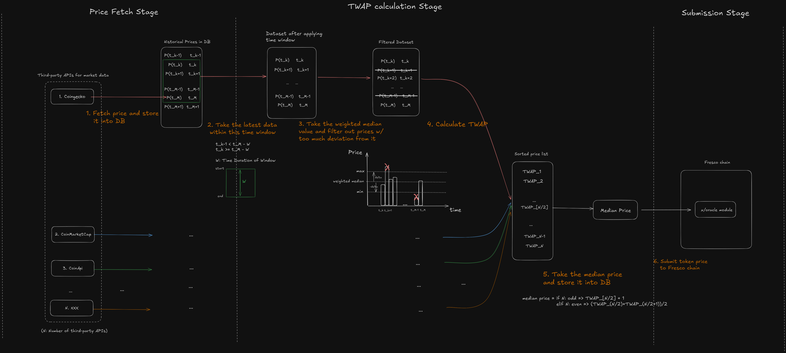

# Architecture



## Overview

This repository contains the Oracle Operator, designed to efficiently retrieve token prices from various third-party services and submit them to the [Oracle module of Fresco chain](https://github.com/Interlocked-Labs/interlock/tree/master/x/oracle). The Oracle Operator ensures that accurate and timely price data is available for decentralized applications.

## System Lifecycle

The lifecycle of the Oracle Operator consists of the following stages:

### Price Fetching Stage

1. **Periodic Price Retrieval**: The operator fetches token prices from multiple third-party services, including [Coingecko](https://coingecko.com), [CoinMarketCap](https://coinmarketcap.com) and [CoinApi](https://coinapi.io). This process is managed by a scheduled cron job, which also stores the retrieved prices with timestamps in a database for future use.

    ```go
    func (o *Oracle) fetchTokenPrices() (types.TokenPrices, error) {
        ...
        coinGeckoPrices, err := fetchTokenPricesFromCoingecko(symbol, tokens.CoinGeckoId)
        ...
        coinCMCPrices, err := fetchTokenPricesFromCoinMarketCap(symbol)
        ...
        coinAPIPrices, err := fetchTokenPricesFromCoinAPI(symbol)
        ...
	    o.addPrices(tokenPrices)
    }
    ```

### Time-Weighted Average Price (TWAP) Calculation Stage

2. **Historical Price Analysis**: The Operator maintains a historical record of token prices from each third-party API at various timestamps, stored in the database. The process retrieves values from the most recent timeframe for subsequent processing.

    ```go
    func GetPrices(symbol string, p db.PriceHistory) (map[string]types.TickerPrice, error) {
        now := time.Now()

        period := TwapPeriodInMinute * time.Minute
        start := now.Add(-period)
        tickers, err := p.GetTickerPrices(symbol, start, now)
        ...
    }
    ```

3. **Weighted Median Calculation**: A weighted median price is calculated using the historical data. For a detailed understanding of how the weighted median is computed, please refer to this [diagram](https://www.researchgate.net/figure/Example-application-of-Weighted-Median-Filters-Ref-de-Rigo-D-2012_fig7_315458492). Prices significantly deviating from this median value are removed from consideration.

    ```go
    func Twap(
        tickers []types.TickerPrice,
        start time.Time,
        end time.Time,
    ) (sdkmath.LegacyDec, int64, error) {
        ...
        median, err := weightedMedian(tickers)
        ...
        // Iterate through the filtered tickers to accumulate valid, time-weighted prices.
        for i := 0; i < len(filteredTickers)-1; i++ {
            ticker := filteredTickers[i]
            nextTicker := filteredTickers[i+1]

            // Calculate the time difference to the next ticker.
            timeDelta := nextTicker.Time.Unix() - ticker.Time.Unix()

            if timeDelta > TwapMaxTimeDeltaSeconds {
                discardedTime = discardedTime + timeDelta
                continue
            }

            // Skip large time gaps or significant price deviations.
            if isTickerValid(ticker, median) {
                priceTotal = priceTotal.Add(ticker.Price.MulInt64(timeDelta))
                validTimeTotal += timeDelta
            } else {
                discardedTime += timeDelta // Assuming discardedTime is initialized and managed globally or externally.
            }
        }

        ...
    }

    // isTickerValid checks if the ticker deviates too significantly from the median price
    func isTickerValid(ticker types.TickerPrice, median sdkmath.LegacyDec) bool {
        maxDeviationRatio := sdkmath.LegacyMustNewDecFromStr(fmt.Sprintf("%f", TwapMaxPriceDeviation))
        max := median.Add(median.Mul(maxDeviationRatio))
        min := median.Sub(median.Mul(maxDeviationRatio))

        return ticker.Price.LT(max) && ticker.Price.GT(min)
    }

    ```

4. **TWAP Computation**: The Time Weighted Average Price (TWAP) is then calculated based on the filtered data. For comprehensive insights into TWAP calculation methods, please consult this [documentation](https://docs.uniswap.org/contracts/v2/concepts/core-concepts/oracles).

5. **Median Price Calculation**: The TWAP prices from various third-party APIs are sorted, and the median value is computed. If the number of services providing prices is odd, the middle value is used. For an even number of values, the median is calculated as the average of the two middle values.

    ```go
    func (o *Oracle) calculateMedianForTokenPrices(tokenPrices []float64) float64 {
        n := len(tokenPrices)
        if n == 0 {
            return 0
        }
        sort.Float64s(tokenPrices)
        middle := n / 2
        if n%2 == 0 {
            return (tokenPrices[middle-1] + tokenPrices[middle]) / 2
        } else {
            return tokenPrices[middle]
        }
    }
    ```

### Data Submission Stage

6. **Submission to Fresco Chain**: The calculated median price for each token is submitted to the Fresco chain, thus completing the data lifecycle.